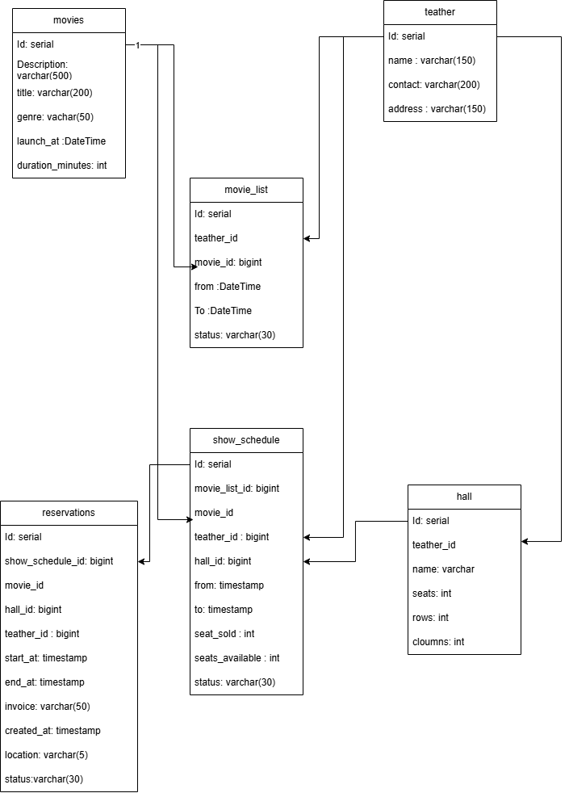

# Cinema booking C#
## Introduccion

This project allows you to manage hotels and generate reservations in a set of hotels.

* Platform .net 8.0
* Api
* Create movies
* [Swagger from Docker compose http://localhost:8090/swagger/index.html](http://localhost:8090/swagger/index.html)
* [Swagger from IDE http://localhost:5056/swagger/index.html](http://localhost:5056/swagger/index.html)


## Tech

Ecommerce project uses next technologies:

- [Net 8.0] - Programing Languague
- [Entity Framework] - ORM management Database
- [Docker] - Distribuition of software
- [Docker Compse] Orchestation


## Installation

```sh
git clone https://github.com/nestorrojas07/cinema.git
cd cinema
docker-compose up --build
```

Endpoints:
- Booking swagger: [swagger](http://localhost:8090/swagger/index.html)


## Local Test

- You need a postgresql 16 running and set the connection string at:
* src/Api/appsettings.Development.json

- You need sdk net 8.0
- Visual Studio OR Rider


## Architecture

I use DDD archictecture and Hexagonal

- Domain (Domain Folder)
- Infrastructure (Infrastructure folder)
- Services (Services folder)
- App (HotelBooking folder)

## Pattern
I used bellow pattern
- Dependency inyection
- Singleton
- Repository
- Builder
- DRY
- Dependency inversion principle
- Manual Mappers because Automapper will be pay license soon.

uml models


AWS proposal infraestructure


Editable file   
[diagrams documentation](./assets/cinema-system.drawio)

Running with Docker Compose    


Generating Report    


Preview Swagger    


Docker File guia   
[swagger file](./assets/swagger.json)


## License

MIT

**Free Software, Hell Yeah!**

[//]: # (These are reference links used in the body of this note and get stripped out when the markdown processor does its job. There is no need to format nicely because it shouldn't be seen. Thanks SO - http://stackoverflow.com/questions/4823468/store-comments-in-markdown-syntax)

[dill]: <https://github.com/joemccann/dillinger>
[git-repo-url]: <https://github.com/joemccann/dillinger.git>
[john gruber]: <http://daringfireball.net>
[df1]: <http://daringfireball.net/projects/markdown/>
[markdown-it]: <https://github.com/markdown-it/markdown-it>
[Ace Editor]: <http://ace.ajax.org>
[node.js]: <http://nodejs.org>
[Twitter Bootstrap]: <http://twitter.github.com/bootstrap/>
[jQuery]: <http://jquery.com>
[@tjholowaychuk]: <http://twitter.com/tjholowaychuk>
[express]: <http://expressjs.com>
[AngularJS]: <http://angularjs.org>
[Gulp]: <http://gulpjs.com>

[PlDb]: <https://github.com/joemccann/dillinger/tree/master/plugins/dropbox/README.md>
[PlGh]: <https://github.com/joemccann/dillinger/tree/master/plugins/github/README.md>
[PlGd]: <https://github.com/joemccann/dillinger/tree/master/plugins/googledrive/README.md>
[PlOd]: <https://github.com/joemccann/dillinger/tree/master/plugins/onedrive/README.md>
[PlMe]: <https://github.com/joemccann/dillinger/tree/master/plugins/medium/README.md>
[PlGa]: <https://github.com/RahulHP/dillinger/blob/master/plugins/googleanalytics/README.md>
